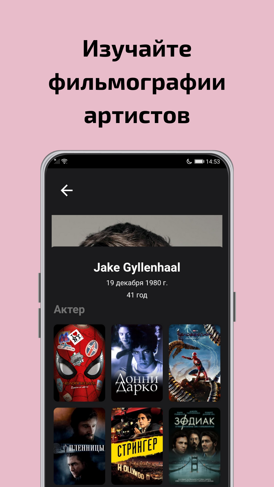

# Поиск фильмов

Данное приложение позволяет любителям кинематографа  искать любимые фильмы и сериалы. Просматривать актуальную информацию по фильмам и сериалам. А также смотреть, в каком сервисе выгоднее всего смотреть фильм на данный момент.

   

   

> :warning: **Не работает в России** Из-за ограничения поставщика данных о фильмах, приложение корректно работает только через VPN

> :exclamation: **Приложение для устройств с OC Android** На других платформах тестирование не проводилось

## Используемый стек технологий
### Архитектура 
Вся логика приложения построена через __Provider__. 

### Откуда данные 
#### Основные данные о фильмах
API TMDB - все данные о фильмах и сериалах 
#### Рейтинги
API OMDB 

### Работа с данными
Все данные взяты с сайта TMDB.
Запросы на API TMDB производятся с помощью пакета [http](https://pub.dev/packages/http).

Обрабатывются результаты в формате JSON для этого были созданы различные классы данных.

### Навигация
Навигация производится по rout-маршрутам через __Navigator__. Все маршруты записаны в файле __main__

### Авторизация
Авторизация производится с помощью [firebase_auth](https://pub.dev/packages/firebase_auth). Для авторизации необходимы email и пароль.

### Хранение данных
История поиска и любимые фильмы и сериалы сохраняются на [Firebase Realtime Database](https://firebase.google.com/docs/database)

### Анимация 
Анимированные переходы осуществленны с помощью встроенных средств Flutter. Анимация в приветственном экране приложения построена с помощью пакета [lottie](https://pub.dev/packages/lottie)

### Воспроизведение видео
Трейлеры фильмов и сериалов берутся через API запрос и воспроизводится youtube видео с помощью пакета [youtube_player_flutter](https://pub.dev/packages/youtube_player_flutter)

### Смена темы
Смены темы прозводится с помощью Provider, а выбор пользователя сохраняется на устройстве, используя [shared_preferences](https://pub.dev/packages/shared_preferences)

## Примеры работы с приложением

### Видео демонстрация 
[Обзор функций приложения](https://youtu.be/HqC_cwTX-24)

## Основные функции в формате GIF с описанием 

### Экран входа в приложение
###

### Обзорный экран по популярным фильмам и сериалам
###

### Фильмы и сериалы по жанрам
###

### Добавление и удаление фильмов в разделе "Избранное"
###

### Поиск фильмов 
###

### История поиска
###

### Одновременный поиск фильмов и сериалов
###

### Экран со всеми результатами поиска
###

###  Обзор фильма - актеры и съемочная группа
###

###  Обзор фильма - просмотр трейлера
###

###  Обзор фильма - "Где можно посмотреть фильм?"
###

## Установка и работа с приложением 

Приложение протестировано и работает только на базе Android.
Для запуска необходим установленный Flutter, VS Code или Android Studio, эмулятор Android девайса или физическое устройство, а также запущенный VPN или Proxy, который позволяет запускать приложение не из России
### Последовательность действий
1. Клонирование репозитория с помощью команды `git clone` в терминале.
2. Установка всех зависимостей _pubspec.yaml_ с помощью команды `flutter pub get`
3. Запуск приложения:
 - Либо через компьютер с подключенным физическим устройством или эмулятором. Выполняем в корне приложения команду `flutter run -d <DEVICE-ID>`
 - Либо в корне приложения собираем apk, вызвав команду `flutter build apk`. Файл устанавливаем на физическое устройство с Android OC. 